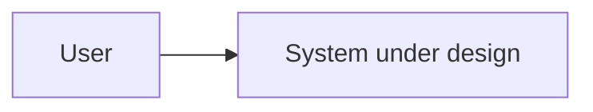

# C4 Model

Use Mermaid diagrams by default. Export images only when the target workflow
requires it, such as a Google Docs deliverable or presentation.

## Context

## Container

TBD

## Component

TBD

## Code

Only add code-level diagrams when they clarify the implementation.
